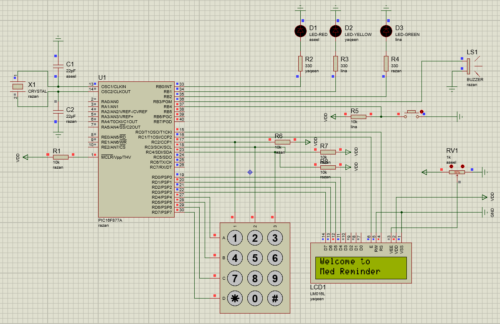

# Simple Medicine Reminder System

Project #4 - ENCS4330 Real-Time Applications & Embedded Systems, Birzeit University.

A medicine reminder built on one **PIC16F877A**, written in PIC assembly (MPLAB) and simulated in Proteus. The system keeps a software clock and manages three medicines, each with one daily reminder time.

> Educational simulation only. It must not be used as a real medical device.

## Schematic

## Hardware

- PIC16F877A, 4 MHz crystal
- 16x2 LCD (LM016L) in 4-bit mode
- 4x3 matrix keypad
- 3 LEDs (red, yellow, green), one per medicine
- Buzzer
- Acknowledgment push button

### Main connections

| Part | PIC pin |
|------|---------|
| Medicine 1 / 2 / 3 LEDs | RB0 / RB1 / RB2 |
| Buzzer | RB3 |
| Acknowledgment button (active low) | RB4 |
| LCD RS / E | RC0 / RC1 |

## How it works

1. **Power-up:** the LCD shows "Welcome to / Med Reminder" for 2 seconds. LEDs and buzzer are off.
2. **Set the time:** enter the current time as HH:MM on the keypad. `#` confirms, `*` clears. Invalid values (like 27:80) are rejected.
3. **Set the reminders:** enter one reminder time for each of the 3 medicines. The LCD shows which medicine is being set.
4. **Normal mode:** line 1 shows the current time, line 2 shows the next medicine and its time. The clock runs on a Timer0 interrupt.
5. **Reminder:** when the time matches, that medicine's LED blinks, the buzzer sounds, and the LCD shows "Take Medicine n".
6. **Acknowledge:** pressing the button turns off the LED and buzzer, shows "Dose Taken" for 2 seconds, then returns to the clock.
7. **Missed dose:** if the button is not pressed in time, the LED and buzzer turn off and the LCD shows "Dose Missed" for 2 seconds.
8. **Same time:** if two medicines share a time, the lower number is served first, then the next one right after.
9. **New day:** after 23:59 the clock goes back to 00:00 and the same reminders are active again.

Only one medicine LED is on at a time. Keypad and button presses are debounced in software, and the button is ignored when no reminder is active.

For a faster demo, one real second is treated as one simulated minute.

## Files

- `Medical_Reminder/main.asm` - source code
- `Medical_Reminder/main.HEX` - compiled output to load in Proteus
- `Medical_Reminder/Medical_Reminder.mcp` - MPLAB project
- `Medical Reminder.pdsprj` - Proteus project
